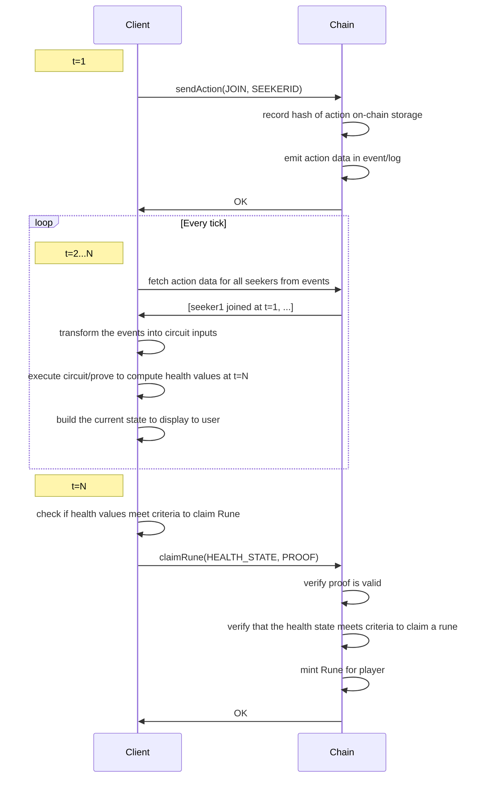

# Combat SNARK

## Overview

Experiment to implement DS/Crypt combat logic as a SNARK so that processing of
the current state can be performed off-chain and verification of the current
health of dungeons and seekers can be performed on-chain.

## Dependencies

You will need:

* [nvm](https://github.com/nvm-sh/nvm)
* [foundry](https://book.getfoundry.sh/getting-started/installation)
* [circom](https://github.com/iden3/circom)
* [jq](https://stedolan.github.io/jq/)
* various GNU tools .. Make, sed etc

## Usage

The bulk of the combat loop is in `combat.circom`

The test at `contracts/tests/e2e.ts` is the best place to walk through the
process of how the client/contract/circuit all interact.

To build the circuit and execute the unit tests (snarkjs/foundry) and the e2e tests (hardhat)

```
make test
```

There is a very basic web frontend to show how it might work in a browser. To
build and run the frontend you will need to setup a local evm node configured
for an "interval mining" mode of ~10s:

```
anvil --block-time 10
```

Then you can deploy the contracts to it:

```
cd contracts
HARDHAT_NETWORK=localhost npx -- ts-node --transpileOnly ./scripts/deploy.ts
```

Then you can start the frontend:

```
cd frontend
npm start
```

## How it works

### Combat rules

The rules of combat are very simple as the focus of this example is the general
pattern rather than the combat itself.

* a Battle is a fixed number (NUM_SEEKERS) of allies (Seekers) vs a single enemy (Dungeon)
* a Battle has a start time (block number)
* a Battle lasts for a fixed number "Ticks" (we define 1 tick == 1 block)
* at the start of a Battle the Dungeon has armour=100 and health=100
* a Dungeon has an attack, armour, and health Alignment
* a Seeker has an attack, armour, and health Alignment
* the alignments between [seeker|dungeon] attack vs [seeker|dungeon] [health|armour] affects the damage inflicted during attack. 
* Seekers can choose to ENTER a Battle
* at ENTER the seeker has armour=100 and health=100
* each Tick the dungeon does some damage to each Seeker's armour (or health if armour == 0).
* each Tick each Seeker does some damage to the Dungeon's armour (or health if armour == 0).
* if the Dungeon's armour gets below 30 then any seeker's with health > 0 can claim a Rune
* if a Dungeon's health drops to 0 it will no longer inflict damage
* if a Seeker's health drops to 0 it will no longer inflict damage
* if a player owns a Rune they can choose to EQUIP it during battle to change how their attacks perform

### Client/Chain interactions

The design is based around players commiting actions (JOIN/EQUIP) on-chain (contract-side), then computing the state of the participants armour/health values off-chain (client-side). If the conditions of the state calculated client-side meet the requirements to claim a prize (Rune), the the player can submit a proof that the health values have met the critiera to the contract to mint/claim their Rune.


